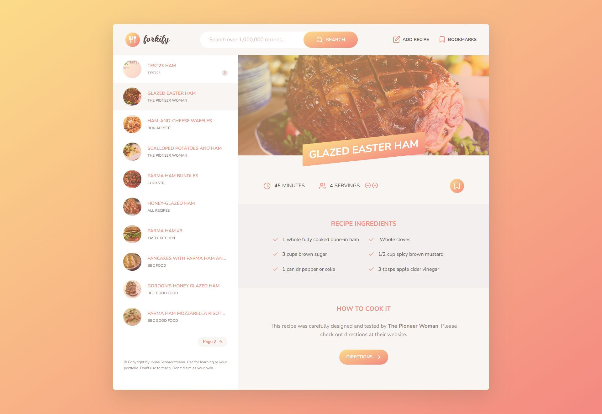

# Forkify app

## About

Forkify is a recipe search and meal planning application. Users can search for recipes from the Forkify API, view detailed recipes, add ingredients to a shopping list, and create bookmarks for their favorite recipes. This app is part of the JavaScript course by Jonas Schmedtmann.

## Table of Contents

- [Screenshot](#screenshot)
- [Demo](#demo)
- [Features](#features)
- [Technologies](#technologies)
- [Installation](#installation)
- [Acknowledgements](#acknowledgements)

## Screenshot



## Demo

Check out the live demo of the app [here](https://jakimoski.github.io/forkify/).

## Features

- Search for recipes by ingredient
- View detailed recipe information
- Add recipe ingredients to a shopping list
- Bookmark favorite recipes
- Responsive design

## Technologies

- **[ JavaScript ]**
- **[ SASS](https://sass-lang.com/)**

## Installation

Clone the project

```bash
  git clone https://github.com/jakimoski/forkify.git
```

Go to the project directory

```bash
  cd my-project
```

Install dependencies

```bash
  npm install
```

Start the app locally

```bash
  npm start
```

Build

```bash
  npm run build
```

## Acknowledgements

Jonas Schmedtmann - For the amazing JavaScript course and guidance.
Forkify API - For providing the recipe data.
